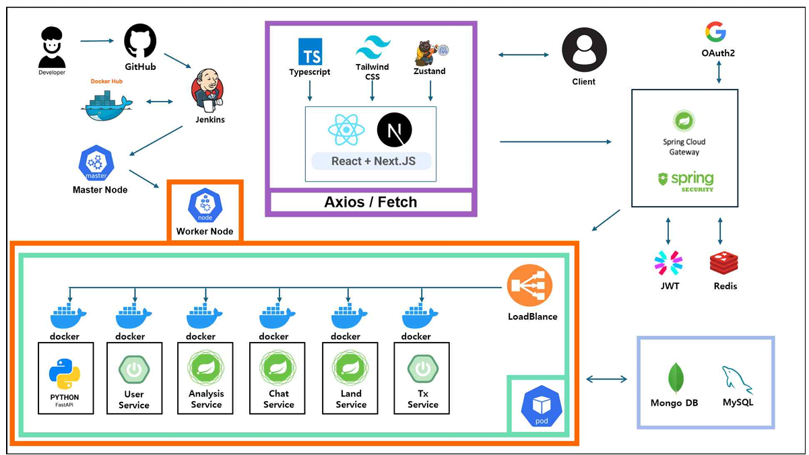

## 🏠개인프로젝트
 - 주제 : 오피스텔 데이터 CRUD
 - 기간 : 2024.05.27 ~ 2024.05.31
 - 개발 환경 :
     :computer: SpringBoot3 (Spring MVC)
     :movie_camera: Next.js14, React17
 - 시연 영상 : https://www.youtube.com/watch?v=nTSPLGzGMIQ
 - 개발 환경 : (Java) Spring MVC - JPQL - QueryDSL - JDBC - MySQL
   
## 🏢 BangEZ 팀 프로젝트
 - 주제 : 부동산 매칭 플랫폼
 - 시연 영상 : https://www.youtube.com/watch?v=mDL24l9_vvw

### 🗓 기간 및 일정
2024.07.10. ~ 2024.08.10.
   
### 🔧 주요 기능
 - AOuth 로그인 및 서버기반 로그인
 - 매물 등록 및 검색
 - 실시간 채팅
 - IamPort API를 이용한 충전 및 결제 기능
 - KakaoMap API를 이용한 지도 기반 매물 제공
 - ReactChartjs2를 이용한 부동산 통계 그래프 제공
 - 공공데이터포털 API와 NEIS API로 받아온 데이터를 이용하여 공원, 학교 입지 정보 제공제공

### 🔑 특징
#### 1) MSA 기반의 개발 및 모듈화된 시스템 설계>
 - 각 서비스(게이트웨이, 유레카 서버, 서비스 서버 등)를 독립적으로 개발하고 멀티모듈로 유지 관리할 수 있도록 구현

#### 2) 실시간 데이터 처리
 - Spring Servlet서버와 함께 Spring WebFlux와 FastAPI서버를 사용해 대규모 트래픽을효과적으로 처리할 수 있는 비동기 처리를 구현

#### 3) 보안 강화
 - Spring Security와 JWT, OAuth를 활용해 사용자의 인증과 권한 관리 강화

#### 4) 클라우드 인프라 활용
 - Naver Cloud Platform(NCP)을 활용해 서버 인프라를 구축하고 관리

### ⚙ 개발환경

### 👀 시스템 아키텍처

